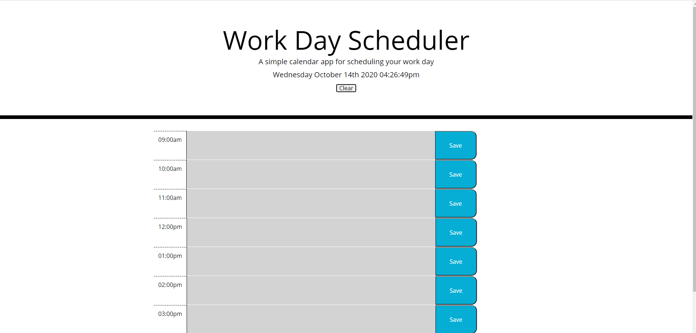
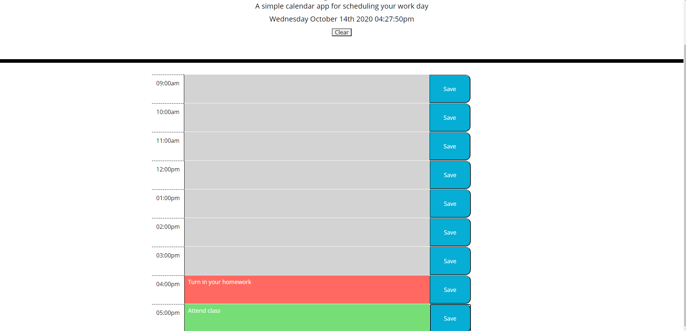

# 
Work-Day-Scheduler
 

## 
Description
 

This is the homework for week five. The goal is to complete a calendar application using a library from https://momentjs.com/. The application should work in the browser and let users save events in time slots of their choice. They can type any notes they have for a specific work hour time slot. The save buttons save their notes to local storage, which means that they'll remain on the page even after refreshing it. The date and time are also displayed at the top, and the clear button underneath it clears all entries.

## 
Screenshots
 

## 
Links
 

* https://github.com/LostandConfusedStudent/Work-Day-Scheduler
* https://lostandconfusedstudent.github.io/Work-Day-Scheduler